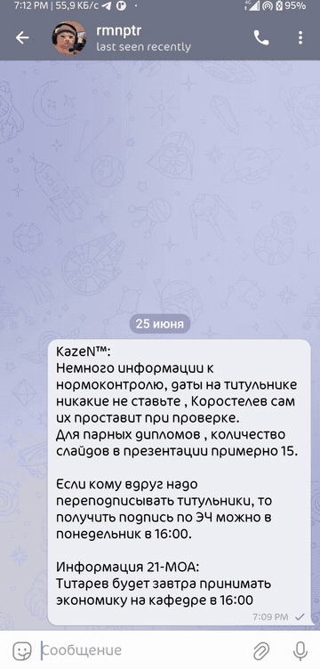
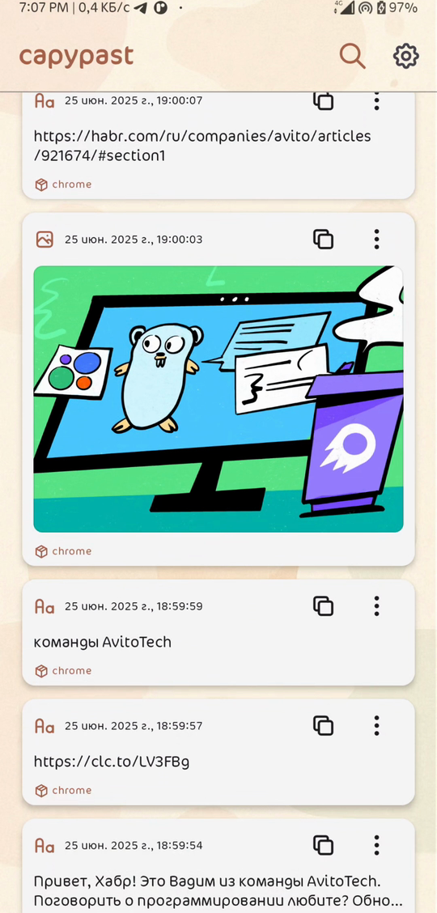
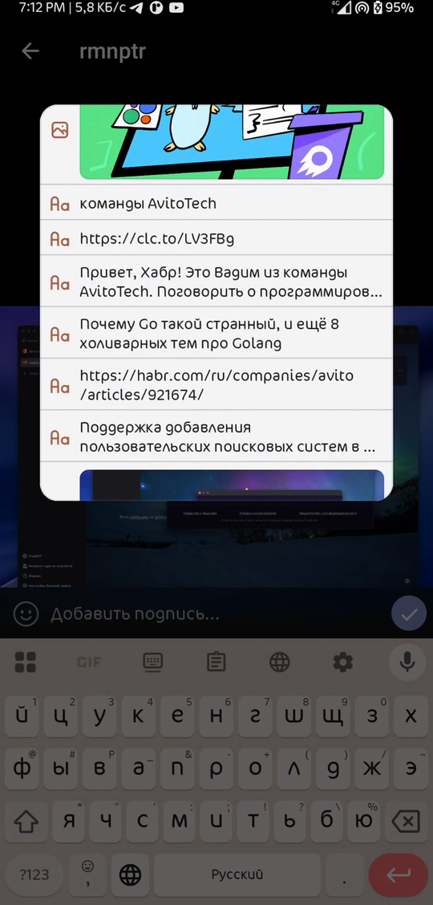
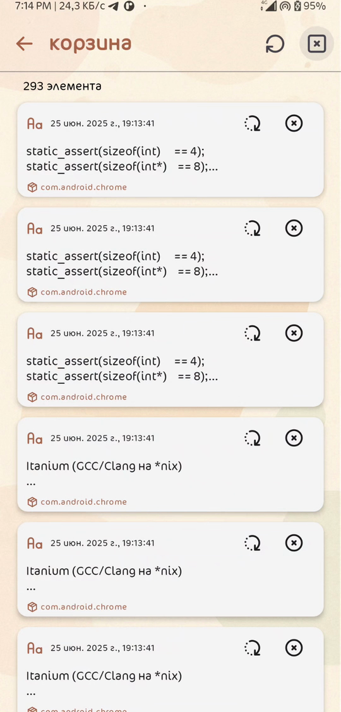
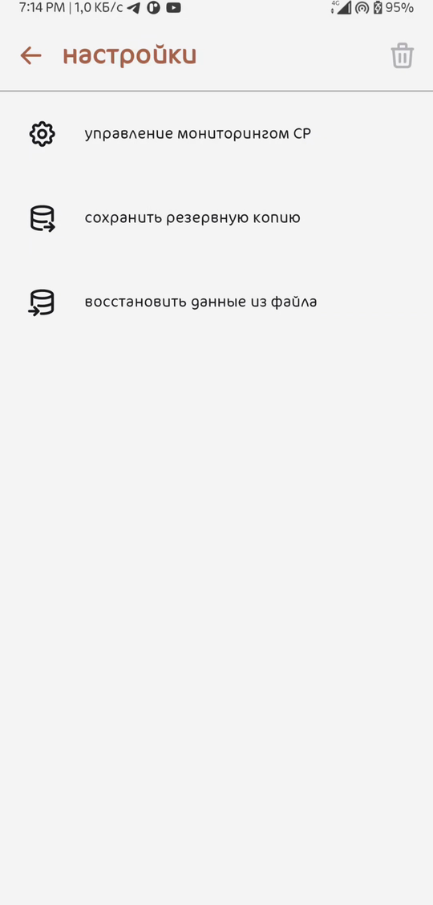
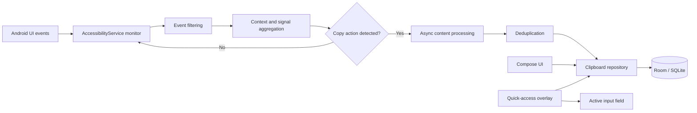
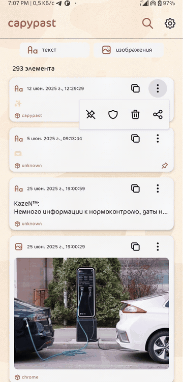

# CapyPast

<p align="center">
  <strong>Clipboard history for Android, built around the restrictions of modern Android versions.</strong>
</p>

<p align="center">
  
  
  
  
</p>

<p align="center">
  
</p>

CapyPast is an Android clipboard history manager that automatically collects copied text and images, stores them locally, and makes previous clips easy to find and reuse.

The project focuses on a problem introduced by modern Android privacy restrictions: a regular background application can no longer rely on continuously reading the system clipboard. CapyPast therefore uses an `AccessibilityService`-based monitoring pipeline and a set of contextual heuristics to detect copy actions, process the copied content, deduplicate it, and persist it in a local Room database.

The application was originally developed as a graduation project and combines the research part of background copy detection with a complete end-user clipboard manager.

## Features

- **Automatic copy detection** for text, links, text fields, and images.
- **Local clipboard history** with timestamps, content type, and source metadata.
- **Search and type filtering** for text and image clips.
- **Pinned clips** that stay at the top of the history.
- **Protected items** guarded by Android device authentication, such as biometrics or the system PIN.
- **Trash and restore workflow** instead of immediately destroying removed clips.
- **Quick-access overlay** that can be opened above another application and used to insert a saved clip into the active text field.
- **Share and re-copy actions** for saved items.
- **Local backup and restore** through file export/import.
- **Paged history loading** for large local collections.

## Screenshots

<p align="center">
  
  
  
  
</p>

<p align="center">
  <sub>History · Quick-access overlay · Trash · Settings</sub>
</p>

## How background monitoring works

Starting with Android 10, ordinary background applications cannot freely read clipboard contents. A foreground service can keep a process alive, but it does not remove the clipboard access restriction.

CapyPast uses accessibility events as the primary source of copy-related signals. The monitor filters the event stream and builds a short-lived context from signals such as:

- text selection changes;
- clicks or context actions associated with copy commands;
- accessibility announcements and notification-state changes that can confirm a copy action;
- timing between selection and the next relevant action;
- relationships between UI nodes involved in the interaction.

These signals are aggregated into a heuristic decision. Once a copy action is considered valid, CapyPast processes the content asynchronously, checks it for duplicates, and stores it locally. Text duplicates are compared by content; image duplicates are checked using file hashes.



This is a heuristic approach, not a privileged Android API. Non-standard UI components and custom `WebView` implementations can omit the accessibility signals that the monitor expects, so some copy actions may still be missed or misclassified.

## Evaluation

The monitoring approach was tested with copy actions performed in applications including Google Chrome, Telegram, Google Docs, Google Slides, Spotify, TikTok, Pinterest, and the system notes application.

The graduation-project test sample produced the following results per 100 copy attempts in each content category:

| Content type | Correct detections | False detections | Missed copies |
| --- | ---: | ---: | ---: |
| Plain text | 100 | 0 | 0 |
| Text fields | 96 | 4 | 0 |
| Images | 94 | 4 | 2 |
| Links | 92 | 0 | 8 |

These numbers describe the tested application set and scenarios; they should not be interpreted as a universal accuracy guarantee for every Android application or custom UI framework.

## Protected clips

<p align="center">
  
</p>

A clip can be marked as protected. Access to protected content is gated through the Android authentication flow and may require biometrics or the system PIN, depending on the device configuration.

## Tech stack

| Area | Technology |
| --- | --- |
| Language | Kotlin |
| UI | Jetpack Compose, Material Design |
| Local storage | Room / SQLite |
| Large lists | Paging 3 |
| Async work | Kotlin Coroutines |
| Reactive state | Kotlin Flow |
| UI state and lifecycle | ViewModel, Lifecycle |
| Navigation | Jetpack Navigation |
| Background monitoring | AccessibilityService, ClipboardManager |
| Build system | Gradle |

## Architecture

The application separates persistence, data access, monitoring, and user-facing components.

- `ClipboardEntity` represents a clipboard-history item and stores its timestamp, content type, content, source metadata, and state flags.
- `TrashEntity` stores removed items that can still be restored.
- `ClipboardDao` and `TrashDao` define database operations, including insertion, updates, deletion, search, and paged loading.
- `ClipboardRepository` and `TrashRepository` isolate the rest of the application from direct database access.
- `MonitorService` handles background monitoring, content-type processing, duplicate detection, and persistence.
- `MoveToTrashInteractor` and `RestoreFromTrashInteractor` encapsulate history-to-trash transitions.
- The Compose UI and the quick-access overlay consume repository data and expose clipboard actions to the user.

## Requirements

- Android 10 / API 29 or newer.
- Android Studio with an Android SDK compatible with the project configuration.
- A physical device is recommended for testing background monitoring, biometric authentication, and cross-application overlay behavior.

## Build from source

Clone the repository:

```bash
git clone https://github.com/flicherr/capypast.git
cd capypast
```

Open the project in Android Studio, wait for Gradle synchronization to finish, select an Android device, and run the application.

For an APK, use the Android Studio build menu to create an APK for the required build variant.

## Initial setup

1. Install and launch CapyPast.
2. Open the application settings.
3. Open the clipboard monitor management option.
4. Grant CapyPast the requested Accessibility Service permission.
5. If the device vendor aggressively restricts background processes, allow unrestricted background/autostart operation for CapyPast.
6. Return to the application. Copy monitoring is now ready to use.

> [!IMPORTANT]
> CapyPast requires Accessibility Service access because Android 10+ restricts ordinary background clipboard reads. Accessibility access is a high-trust Android capability and can expose UI content and interaction events to the enabled service. Review the source code and grant the permission only if you understand and accept this behavior.

## Data and privacy

Clipboard history is stored locally in the application's Room database. The current project does not implement cloud synchronization. Backup and restore are performed through local files selected by the user.

Protected items use Android device authentication as an access gate before protected content is exposed through the application UI.

## Roadmap

Planned directions for further development include:

- full user-defined tag management;
- clipboard-history synchronization between Android and Windows/Linux clients;
- editing saved history items;
- further refinement of the copy-detection heuristics.

## Project context

CapyPast was developed as a study of dynamic clipboard-history management on Android and of background copy detection under Android 10+ clipboard-access restrictions. The project includes requirements analysis, architecture and UML modeling, implementation, heuristic monitoring experiments, and functional testing of history management, search, filtering, protected access, trash recovery, backup/restore, and the quick-access overlay.
